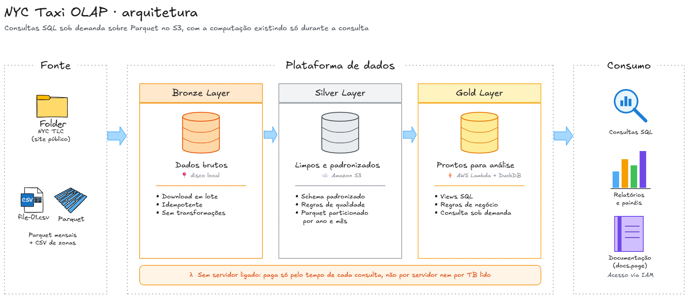

# NYC Taxi OLAP: DuckDB + AWS Lambda + S3

Engine analítica sob demanda sobre **308 milhões de corridas** do táxi amarelo de Nova York (jan/2019 a dez/2025). Os dados ficam em Parquet particionado no Amazon S3, e a computação só existe durante a consulta: uma AWS Lambda com DuckDB executa o SQL e devolve o resultado em JSON.

📘 **Documentação completa (dicionário de dados, regras de qualidade e desempenho):** [docs.page/AndreVVoigt/olap-lambda-duckdb](https://docs.page/AndreVVoigt/olap-lambda-duckdb)



## Números

| Métrica | Valor |
|---|---|
| Corridas no lake | 307.999.349 (84 meses) |
| Tamanho bruto → lake | 4,87 GB → ~3,6 GB (Parquet + zstd) |
| Ingestão dos 84 meses | 3,1 min, 0 falhas |
| Consulta de um mês na Lambda | ~0,9 s |
| Agregação do lake inteiro na Lambda | 5,7 s |
| Mesma agregação, PC lendo do S3 pela internet | 108,5 s |
| Cold start | ~1,5 s |
| Custo por consulta (lake inteiro) | ~US$ 0,0002 |

## Arquitetura

| Camada | Onde | O que faz |
|---|---|---|
| **Bronze** | Local (`data/raw`) | Download dos Parquet originais do NYC TLC, em paralelo, com retry e escrita atômica |
| **Silver** | Amazon S3 | Schema padronizado, regras de qualidade aplicadas, particionado por `ano`/`mes`, ordenado e comprimido |
| **Gold** | AWS Lambda + DuckDB | Views `trips`, `trips_validas` e `zones`, consultadas com SQL sob demanda |

A Lambda não tem URL pública: só pode ser invocada com credenciais IAM da conta. A role da Lambda só tem permissão de leitura no bucket do lake.

## Destaques técnicos

- **Exploração antes da ingestão.** O schema dos 84 arquivos foi analisado lendo só os metadados remotos, o que revelou uma mudança de tipos em fev/2023 e a coluna `airport_fee` com dois nomes.
- **Regras de qualidade explícitas.** Cada problema encontrado foi classificado como descartar, sinalizar ou manter. Valores implausíveis ficam no lake com a flag `is_suspeita`, em vez de serem apagados. [Detalhes](https://docs.page/AndreVVoigt/olap-lambda-duckdb/qualidade)
- **Ingestão idempotente.** Downloads e transformações já feitos são pulados, e arquivos parciais nunca chegam ao lake (escrita em arquivo temporário + rename).
- **Validação cruzada.** As linhas lidas na ingestão batem com a contagem feita nos metadados remotos durante a exploração.
- **Investigação de desempenho.** A agregação do lake inteiro passou de timeout (acima de 60 s) para 5,7 s. Mais memória e mais threads ajudaram pouco. A causa real eram os row groups pequenos do Parquet, que geravam ~2.550 pedidos ao S3. Com row groups de ~2 milhões de linhas, caíram para ~190. [Detalhes](https://docs.page/AndreVVoigt/olap-lambda-duckdb/desempenho)

## Stack

Python 3.13 · DuckDB · Parquet · AWS Lambda (container image) · Amazon S3 · Amazon ECR · IAM · CloudWatch · Docker · docs.page

## Estrutura do repositório

```
├── explore/01_exploracao.ipynb   # exploração do dataset e proposta de regras
├── ingest/ingest.py              # Bronze → Silver: download, padronização, qualidade, particionamento
├── lambda/
│   ├── handler.py                # handler da Lambda: views + execução do SQL
│   ├── Dockerfile                # imagem com DuckDB e extensões pré-instaladas
│   ├── requirements.txt
│   ├── teste_local.py            # testes do handler sem AWS
│   └── eventos/                  # eventos JSON para invocar a Lambda
├── infra/                        # políticas IAM da role da Lambda
├── consultar.py                  # cliente: envia SQL à Lambda e imprime o resultado
├── consultas/                    # consultas de exemplo (.sql)
├── docs.json, docs/              # documentação publicada no docs.page
└── data/                         # dados locais (fora do Git)
```

## Como consultar

Com credenciais AWS configuradas (`aws configure`) e o `boto3` instalado:

```bash
python consultar.py "SELECT ano, count(*) AS corridas FROM trips_validas GROUP BY ano ORDER BY ano"
python consultar.py -f consultas/por_ano.sql
```

```
ano   corridas  receita_mi_usd
----  --------  --------------
2019  83840079  1594.6
2020  24314849  441.1
...
2025  47316549  1272.3

7 linhas em 9352 ms
```

Tabelas disponíveis e exemplos: [Como consultar](https://docs.page/AndreVVoigt/olap-lambda-duckdb/consultas).

## Como reproduzir

Pré-requisitos: Python 3.13, Docker, AWS CLI configurada e uma conta AWS.

**1. Ambiente e ingestão**

```bash
python -m venv .venv
# Windows: .venv\Scripts\Activate.ps1 · Linux/macOS: source .venv/bin/activate
pip install -r requirements-dev.txt
python ingest/ingest.py
```

**2. Lake no S3**

```bash
aws s3 mb s3://<bucket> --region us-east-1
aws s3 sync data/lake s3://<bucket>/
```

**3. Imagem da Lambda no ECR**

```bash
aws ecr create-repository --repository-name olap-duckdb --region us-east-1
aws ecr get-login-password --region us-east-1 | docker login --username AWS --password-stdin <conta>.dkr.ecr.us-east-1.amazonaws.com
cd lambda
docker buildx build --platform linux/amd64 --provenance=false -t <conta>.dkr.ecr.us-east-1.amazonaws.com/olap-duckdb:v1 .
docker push <conta>.dkr.ecr.us-east-1.amazonaws.com/olap-duckdb:v1
cd ..
```

**4. Role e função**

Ajuste o nome do bucket em `infra/s3-read-policy.json` e rode:

```bash
aws iam create-role --role-name olap-duckdb-lambda-role --assume-role-policy-document file://infra/trust-policy.json
aws iam attach-role-policy --role-name olap-duckdb-lambda-role --policy-arn arn:aws:iam::aws:policy/service-role/AWSLambdaBasicExecutionRole
aws iam put-role-policy --role-name olap-duckdb-lambda-role --policy-name s3-read-lake --policy-document file://infra/s3-read-policy.json

aws lambda create-function \
  --function-name olap-duckdb \
  --package-type Image \
  --code ImageUri=<conta>.dkr.ecr.us-east-1.amazonaws.com/olap-duckdb:v1 \
  --role arn:aws:iam::<conta>:role/olap-duckdb-lambda-role \
  --memory-size 2048 --timeout 60 \
  --environment "Variables={LAKE_URI=s3://<bucket>,DUCKDB_THREADS=16}" \
  --region us-east-1
```

## Custos

A Lambda não custa nada parada. Cada agregação do lake inteiro usa ~12 GB-s (~US$ 0,0002). O armazenamento de ~3,6 GB no S3 custa centavos por mês.

## Limitações

- Consultas limitadas a 60 s (timeout da Lambda) e respostas a 10.000 linhas.
- O DuckDB roda numa única máquina: o desenho atende volumes de GBs, não TBs.
- Row groups grandes favorecem varreduras amplas no S3, mas deixam menos eficiente o filtro de intervalos estreitos (ex.: um único dia).

## Evoluções possíveis

- Tabelas pré-agregadas no ingest para consultas sobre o histórico inteiro.
- Cache de resultados no S3 para consultas repetidas.
- Ingestão incremental agendada para os meses novos.

## Dados

[NYC TLC Trip Record Data](https://www.nyc.gov/site/tlc/about/tlc-trip-record-data.page), dados públicos da Taxi & Limousine Commission de Nova York.